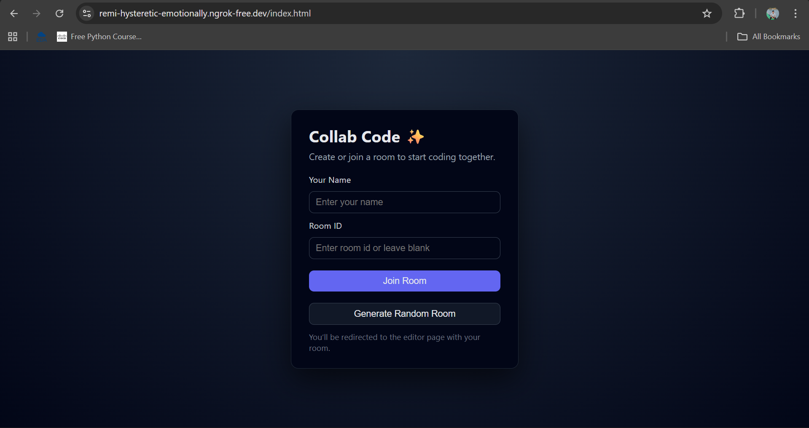
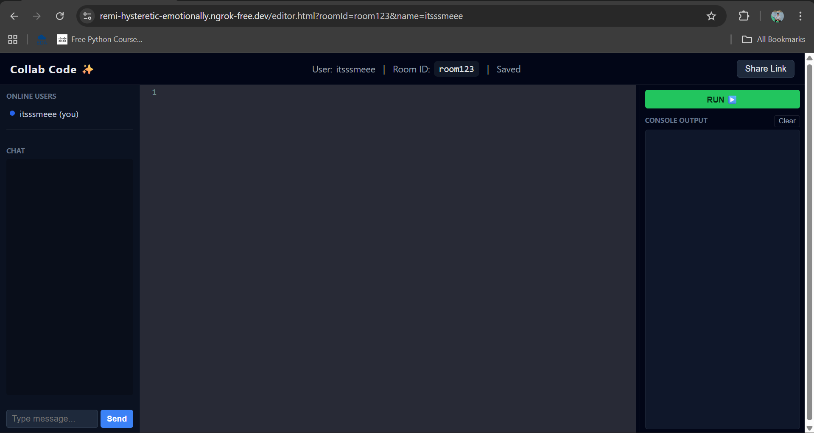
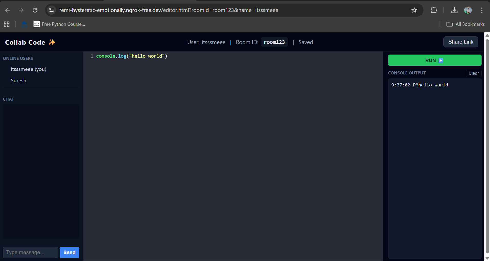

# 🧑‍💻 Real-Time Collaborative Code Editor

A full-stack **real-time collaborative code editor** that allows multiple users to join a room, edit code together, chat, see typing indicators, and run code with live output.

Built using **Node.js, Express, Socket.IO, and CodeMirror**.

---

## 🚀 Features

- 🔗 Shareable room-based collaboration
- 👥 Multiple users editing the same code in real time
- ⌨️ Live typing indicator
- 💬 Built-in chat system
- 🖱️ Cursor position sync (VS Code–like)
- ▶️ Run code and view output instantly
- 🛑 Host approval system for joining users
- 📱 Responsive UI layout
- 🔄 Resizable editor and output panels

---

## 🛠️ Tech Stack

### Frontend
- HTML
- CSS
- JavaScript
- CodeMirror Editor

### Backend
- Node.js
- Express.js
- Socket.IO

---

## 📸 Screenshots

### Home Page


### Editor with Chat


### Live Collaboration


---

## ⚙️ Installation & Setup

### 1️⃣ Clone the repository
```bash
git clone https://github.com/Ratnakar003/collaborative-code-editor.git
cd collaborative-code-editor
